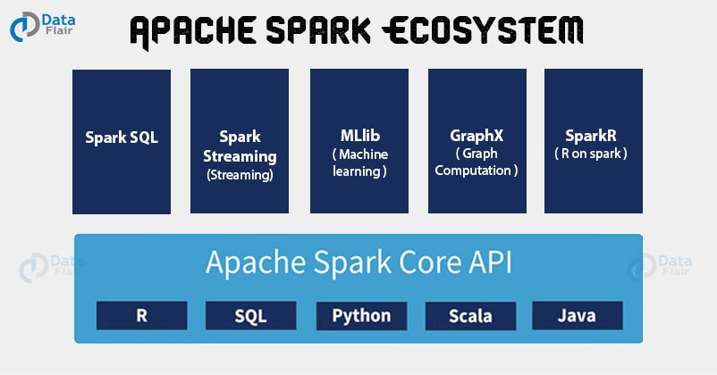

+++
title = "An Introduction to Spark Transformations in Python"
date = 2020-04-08T16:10:32-05:00
tags = ["pyspark", "python", "spark"]
categories = ["programming", "data science"]
draft = false
+++


## Introduction
So I got hold of this huge file and the first thing I did was to read it using
`pandas`. I noticed that it took quite a while to read the damn thing but whatever
I can spare a minute of my life. However, when I started to transform
the pandas dataframe weird things started to happen-- Spyder froze and frequently
crashed. This is when I realized that there had to be a better way.

And of course there is a better way: the [Spark](https://spark.apache.org/) way. To put shortly, Spark allows
you to deal with massive datasets by distributing the processing among a computer
cluster or CPUs in your local workstation. Man I wish I had a computer cluster to deal with.
The best thing in my opinion is that it's easy
to learn and you can use this powerful tool without ever leaving the Python ecosystem
by using the `pyspark` package. However,
it can be a little of a challenge to get it installed so I wrote a guide
on how to install `pyspark` on a Windows 10 machine [here](https://medium.com/i-want-to-be-the-very-best/installing-apache-spark-on-windows-10-ce1c45de35ab).

In this post we will only focus on learning the basics of transformations in Spark to get you
started.


## The Components of Spark
Spark is made of many subcomponents (see the Figure below). The main component
we will be dealing today will be the Spark Core. With this component we can create
a Spark object known as **Resilient Distributed Dataset (RDD)** which we can
then use to transform the data. The cool thing about the RDD is that it splits
the workload and makes sure that if one of your
computers or CPUs goes down, it can recover without giving you a nasty error
and continue the job. This advantageous because you don't want to start all
over again a job that took hours or days to complete just because one of your
computers or CPUs crashed at the end.



The rest of the Spark components run on top of it and can be used to build fast
and scalable pipelines. We won't talk about them in this post but from their
names you could guess their main functions.


## The Resilient Distributed Dataset (RDD)
Earlier we talked about RDDs and you definitely don't need to worry very much
about the technicalities about how they work. If you're like me, you just
want to know what are they and how to use them. Just remember that an RDD is an
object that you create with Spark that represents your dataset. Once
you execute a transformation on your dataset using the build-in methods of the
RDD, the RDD will know how to distribute this job into your cluster of computers
or CPUs in your local workstation. It will also keep track of how the data flows
and will ensure that the job will keep running even if one of your nodes fails.

### Creating Our First RDDs
So enough talking, let's create some RDDs:

```python
# Import Libraries
from pyspark import SparkConf, SparkContext

# Set up SparkContext
conf = SparkConf().setMaster('local').setAppName('App Name')
sc = SparkContext(conf = conf)

# Define a list
my_list = list(range(10)) # [0, 1, 2, 3, 4, 5, 6, 7, 8, 9]

# Create rdd
rdd = sc.parallelize((my_list))
```

In the script shown above, we first import the objects `SparkConf` and `SparkContext`.
This is a common line that you will always see when writing or reading Spark scripts
so let's talk about it:
* The `SparkConf` is an object in Spark that helps you configure
the object known as `SparkContext`.

* `SparkContext` is an object in Spark that you can use to create RDDs.

Next, we define the configuration we will like to run Spark with using
`SparkConf`. Let's take a closer look:

```python
conf = SparkConf().setMaster('local').setAppName('Job Name')
```

In this line of code, we use the `setMaster()` method to tell Spark to run locally
with a given number of cores. In this example, we passed the string value `'local'`
to `setMaster()` for the purpose of testing. This means that Spark will only
use one core/CPU to run locally in our machine. Here are the other strings you can pass:

* `'local'`: uses 1 thread only.

* `'local[n]'`: uses n threads. For example, pass `'local[2]'` to use two cores.

* `'local[*]'`: uses as many threads as the number of processors available.

We also set the name of the app using `setAppName()` method. It's good practice
to give a name to your jobs so that you can keep track of them. In practice,
you should never use `'local'` because it would mean you're not splitting and
processing your data among different workers.

In the next line of code, we create an instance of `SparkContext()` object using:

```python
sc = SparkContext(conf = conf)
```

Now we are ready to use `sc` to create our first RDD
but first we need create some data using:

```python
my_list = list(range(10)) # [0, 1, 2, 3, 4, 5, 6, 7, 8, 9]
```

Finally, we create our RDD using the `parallelize()` method in `sc`:
```python
rdd = sc.parallelize((my_list))
```
You can use the `parallelize()` method to create a RDD from Python built-in collections
such as `list`, `dict`, `tuples` etc.

### Creating an RDD from a Saved File
Let's go thorough another exercise. This time, we will create an RDD by loading
data from a file into it. The file we will be using comes from a compilation of
data put together by the New York Times and it keeps track of the coronavirus
cases and deaths in each county in the USA. You can grab the file named `us-counties.csv`
from [here](https://github.com/nytimes/covid-19-data) and save it in your
working directory. Here is how the data county level data is organized:

```text
date,county,state,fips,cases,deaths
2020-01-21,Snohomish,Washington,53061,1,0
...
```
In this dataset, every value is separated by a comma and each line
represents an observation for the number of cases and deaths related to Covid-19
for a given day at a county. The first line of data contains the column labels.
Let's get familiar with this dataset since we are going to be using it for the rest of this post.

* `date`: the date the record was collected
* `county`: the county where the observations occurred
* `state`: the state where the observations occurred
* `fips`: a five-digit Federal Information Processing Standards (FIPS) code which uniquely identified counties and county equivalents in the United States
* `cases`: the number of covid-19 cases
* `deaths`: the number of covid-19 related cases

Now that we have our file and understand its contents, lets load it into an RDD.
Take a look at the script below, it should be familiar to you by now:
```python
# Import Libraries
from pyspark import SparkConf, SparkContext

# Set up SparkContext
conf = SparkConf().setMaster('local').setAppName('App Name2')
sc = SparkContext(conf = conf)

# Define a list
path = 'us-counties.csv'

# Create rdd
rdd = sc.textFile(path)
```
Essentially, the only new line in this script is: `rdd = sc.textFile(path)`. Here,
we used the `textFile()` method of the `sc` object to read the data from a saved text
file. We pass a `str` object that points to the location where the file is saved.


## RDDs Transformations and Actions
So now that you know how to create RDDs, let's transform them and apply some
actions to them. In other words, let's process the raw data by transforming it
into something useful.

### RDD Transformations
A transformation is just a map from one dataset to another. Let's talk about some common
transformations that are available to an RDD:

#### Map
* `map()`: a `map()` is a method that transforms every line in the RDD and results
in a new RDD. By using `map()`, you can apply a function to every element of the
RDD to transform it into a new line. This mapping is one to one which means that the number
of lines in the transformed RDD is the same as the number of lines in the
original RDD.

Let's see the simplest example of the `map()` method:
```python
# Applying a map to an rdd
rdd_transformed = rdd.map(lambda line: line)
```
So let’s break it down. The RDD instance that we created earlier `rdd` when we
loaded the us-counties.csv file into it contains several methods that allow you
to transform the data. To access the `map()` method, we use `rdd.map()`. The
`map()` method takes in a function that will be applied to every line of `rdd`.
In this example, we passed `lambda: line: line`, a lambda function. [Here](https://www.afternerd.com/blog/python-lambdas/) is an excellent resource if you need to brush up in your lambda function background.
I recommend that you become comfortable with lambda functions before
you continue reading this article. Each line in `rdd` is a string which gets passed to our lambda function that
returns the same line back. The results of our transformation
get stored into `rdd_transformed`.

To see the results of our transformation, we will use the `collect()` method
of the RDD. The `collect` method is known as an action. We will use `collect()`
to transform `rdd_transformed` into a list.
```python
# Applying a map to an rdd
transformed_list = rdd_transformed.collect()
```
If you were to inspect the first 5 elements of `transformed_list`, you should see:

```text
 ['2020-01-21,Snohomish,Washington,53061,1,0',
 '2020-01-22,Snohomish,Washington,53061,1,0',
 '2020-01-23,Snohomish,Washington,53061,1,0',
 '2020-01-24,Cook,Illinois,17031,1,0']
```

Notice that each element of the list is a string. We can further transforms
the data by splitting each string using the Python build-in `split()` method.
```python
# Applying a map to an rdd
rdd_transformed = rdd.map(lambda line: line.split(','))
transformed_list = rdd_transformed.collect()
transformed_list[0:5]
```
Where the output would be:
```text
[['date', 'county', 'state', 'fips', 'cases', 'deaths'],
 ['2020-01-21', 'Snohomish', 'Washington', '53061', '1', '0'],
 ['2020-01-22', 'Snohomish', 'Washington', '53061', '1', '0'],
 ['2020-01-23', 'Snohomish', 'Washington', '53061', '1', '0'],
 ['2020-01-24', 'Cook', 'Illinois', '17031', '1', '0']]
```

If you were only interested in the dates you could select the first element
of each list like so:
```python
rdd_dates = rdd.map(lambda line: line.split(',')[0])
dates_list = rdd_dates.collect()
dates_list[0:5]
```
The output would be:
```text
['date', '2020-01-21', '2020-01-22', '2020-01-23', '2020-01-24']
```

This should give you a pretty good idea on how the `map()` method works. Let's now
turn our attention to another RDD transformation:

#### FlatMap
* `flatMap()`: Similar to `map()`, the `flatMap()` method allows you to transform
every line in the RDD; however, this time number of lines in the
transformed RDD can be less than, the same, or more than the number of lines in the
original RDD.

Here is an example on how to use `flatmap()`, notice that it's very similar to
how we used `map()`; however, the results are entirely different.
```python
rdd_transformed = rdd.flatMap(lambda line: line.split(','))
transformed_list = rdd_transformed.collect()
transformed_list[0:10]
```
The following are the first 10 elements of `transformed_list`
```text
['date',
 'county',
 'state',
 'fips',
 'cases',
 'deaths',
 '2020-01-21',
 'Snohomish',
 'Washington',
 '53061']
```
Let's dig a little bit deeper to see how `flatmap()` works. We passed `lambda line: line.split(',')`
to `flatmap()`. The lambda function we passed splits every line into a list that contains
several elements. Then `flatmap()` takes this list and makes every element in the
list a new line in `transformed_rdd`.

#### Filter
* `filter()`: a method that can be used to filter out information. It takes
in a function which output is either `True` or `False`. Lines where the output
is `True` are kept and lines where the output is `False` are discarded.

So using `filter()`, let's filter `rdd` and only keep lines where the state is
`'Texas'`.

```python
rdd_transformed = rdd.filter(lambda line: line.split(',')[2] == 'Texas')
transformed_list = rdd_transformed.collect()
transformed_list[0:10]
```
The output should be:
```text
['2020-02-12,Bexar,Texas,48029,1,0',
 '2020-02-13,Bexar,Texas,48029,2,0',
 '2020-02-14,Bexar,Texas,48029,2,0',
 '2020-02-15,Bexar,Texas,48029,2,0',
 '2020-02-16,Bexar,Texas,48029,2,0',
 '2020-02-17,Bexar,Texas,48029,2,0',
 '2020-02-18,Bexar,Texas,48029,2,0',
 '2020-02-19,Bexar,Texas,48029,2,0',
 '2020-02-20,Bexar,Texas,48029,2,0',
 '2020-02-21,Bexar,Texas,48029,4,0']
```
Notice how every line has `'Texas'` in it just like we expected. Hopefully,
by now you should be getting comfortable with RDDs but for the sake of completion
let's discuss the above script in more in detail. The function that we passed
to `filter()` was `lambda line: line.split(',')[2] == 'Texas'`. This function
will split each line in `rdd` and save the results in to a list. Then we
set a conditional statement where we check if the second element of this list equals
to the string `'Texas'`. The second element of the list its the state column
of our data. If the statement is `True`, the line is kept and if the statement
is `False` the line is discarded.


#### Distinct
Suppose that you wanted to get all the unique values in the state column.
To do this, you would use the `distinct()` method.
* `distinct()`: this method allows you to get the unique values of the rdd
and discards all the duplicates.

Here is an example of how to do just that:
```python
rdd_transformed = rdd.map(lambda line: line.split(',')[2]).distinct()
transformed_list = rdd_transformed.collect()
transformed_list[0:10]
```
Let's talk a bit more about the details of what just happened. We will break it
into parts. ` rdd.map(lambda line: line.split(',')[2])` will create an RDD
that contains the information in the state column. To this RDD we apply the
`distinct()` method which takes this RDD and finds all the unique values in it.
The rest of the script should be familiar by now. Here are the first 10 elements of `transformed_list`:
```text
['state',
 'Washington',
 'Illinois',
 'California',
 'Arizona',
 'Massachusetts',
 'Wisconsin',
 'Texas',
 'Nebraska',
 'Utah']
```

#### Sample
The `sample()` transformation allows you to sample your RDD. This can be useful
in situations where you want to develop your pipeline but don't want to use
a huge dataset while doing so. Therefore, you can sample your RDD and work
with a smaller chunk of data.

* `sample()`: this method takes in 2 parameters.
  * `withReplacement`: this value can be set to either `True` or `False`  and determines whether elements be sampled multiple times (replaced when sampled out)
  * `fraction`: expected size of the sample as a fraction of this RDD's size
            without replacement: probability that each element is chosen; fraction must be [0, 1]
            with replacement: expected number of times each element is chosen; fraction must be >= 0

Let's see this in action:
```python
rdd_transformed = rdd.sample(withReplacement = False, fraction = 0.01)
transformed_list = rdd_transformed.collect()
```
The length of `transformed_list` should be 1% of the size of `rdd`.


## Closing Remarks
In this post, we have learned how to create RDDs and transform them using some of the RDD methods.
We have covered a lot of ground in this post but we are barely scratching the surface
when it comes to the things we can do with Spark. Remember that Spark is a fast and scalable
technology that can be used to process large-scale data.

You are welcome to contact me on [LinkedIn](https://www.linkedin.com/in/frank-ceballos/).

Until next time, take care, and code everyday!


